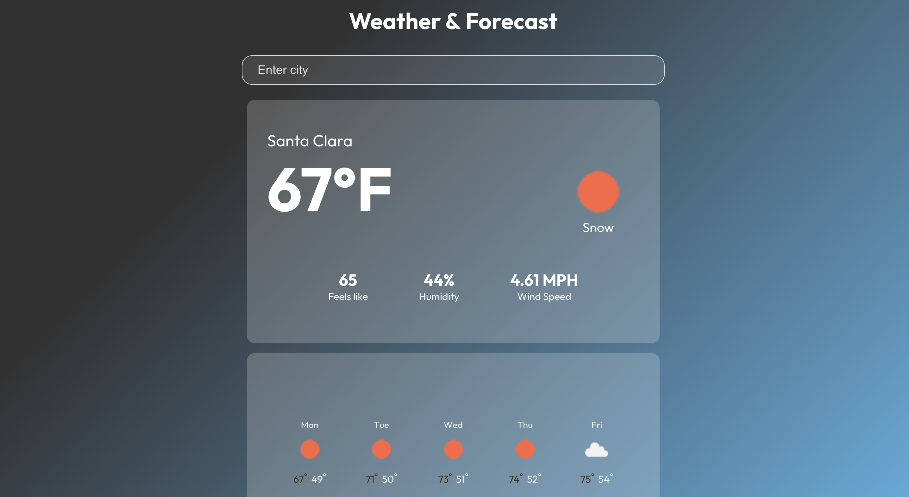

# Weather App (Web Application).

### UI Features:
1. Default page gives the weather of the users current location.
2. User can provide city and get the weather information.
3. User can forecast weather.

### Backend Features:
1. Multiple users can get the weather information at the same time (Async communication).
2. Records every REST API call made to the backend in a database for traceback.
3. All the above features are exposed via REST API for other applications to use.

### Steps to run the app locally.

#### React App:
1. cd weather-client
2. npm install
3. npm start

### Backend App:
1. cd weather-server
2. npm install
3. Add Acccess key , Secret key & Region for AWS DynamoDB in .env file in /weather-server as follows.
AWS_ACCESS_KEY_ID = "Your Access key"
AWS_SECRET_ACCESS_KEY = "Your secret Key"
AWS_REGION = "Region where dynamoDb is created"
4. npm start

### DynamoDB table:

### Webapp screenshots:

#### Clear sky

#### Snowy weather

#### Mist, Smoke, Haze

